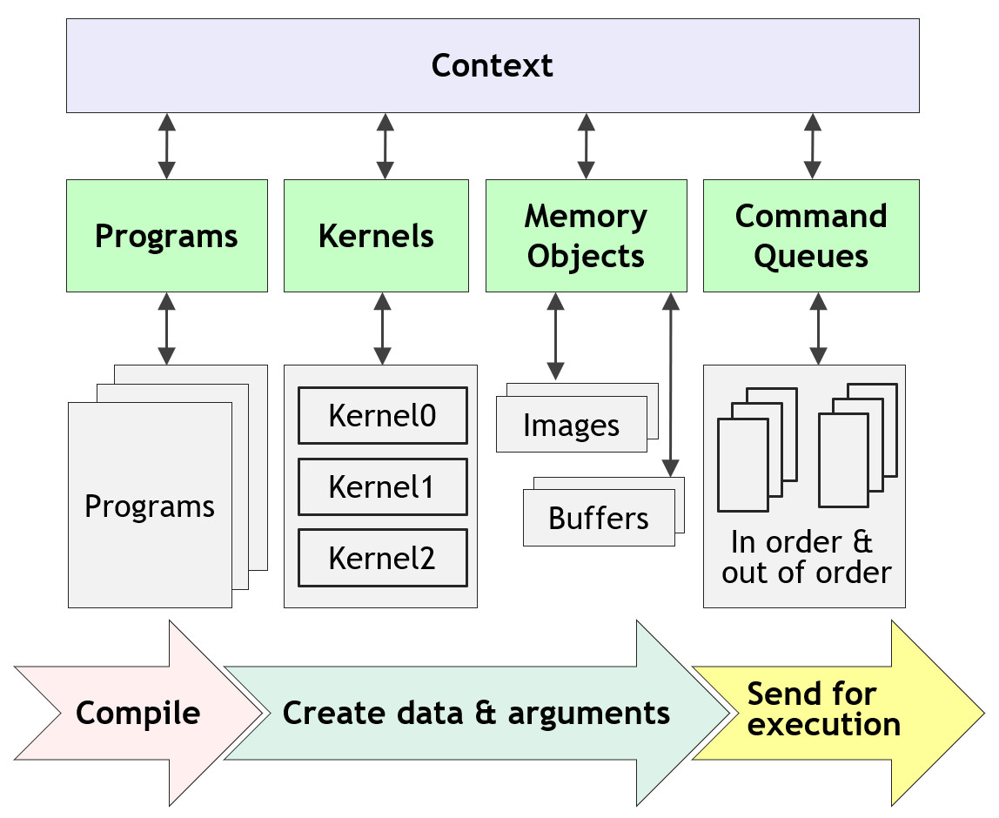

# VGG16-OpenCL


__`VGG16-OpenCL` is an implementation of the inference module of the  VGG16 model pre-trained on the [`CIFAR 10`](https://www.cs.toronto.edu/~kriz/cifar.html) dataset. The goal of this project is to optimize the model to *reduce inference time* using OpenCL framework.__

[`OpenCL`](https://www.khronos.org/opencl/) is a framework for writing programs that execute across heterogeneous platforms consisting of various processors and hardware accelerators. It provides programming languages and APIs to execute programs on these compute devices.

[`VGG16`](https://arxiv.org/abs/1409.1556) was proposed in the paper [*Very Deep Convolutional Networks for Large-Scale Image Recognition*](https://arxiv.org/abs/1409.1556) by K. Simonyan and A. Zisserman and designed to work on 224 $\times$ 224 pixel input images. However, the model in this project has been adapted for `CIFAR 10` dataset, which includes 32 $\times$ 32 pixel images.


## Prerequisites

You need the following hardware and software installed on your machine:

   * An OpenCL compatible processor
   * Visual Studio (Optional)
   * OpenCL SDK

> **PLEASE NOTE**: This project is written in Visual Studio on Windows. While it is possible to build the project in IDEs other than Visual Studio, you will need to create appropriate build configurations for your IDE and/or platform.


## Getting Started

   1. Clone this repository to your local machine:
      ```
      git clone https://github.com/sjleo1/VGG16-OpenCL.git
      cd VGG16-OpenCL
      ```
   2. Open the `.sln` file in Visual Studio
   3. Select `Build Solution` from the `Build` menu


## Project Outline

This project includes separate pieces of source code that performs inference in serial and in parallel. You can choose between these two operation methods, and will get an elapsed time of the operation after the result is verified.

In this project, the performance results from the two different operation methods are compared to evaluate the optimization.

### Short description of how OpenCL program works

<center></center>

   1. Selecting **device**s and defining a **context**: Context is the environment within which the kernels are defined and execute.
   2. Creating **command-queue**s: The host and the OpenCL devices interact with each other through commands posted by the host.
   3. Building **program object**s: Program object is compiled and linked to generate kernels for OpenCL devices.
   4. Creating **memory object**s: The host program defines memory objects required and pass them onto the arguments of kernels.
   5. Enqueueing **command**s: Commands are enqueued to the command-queues to execute the kernels.

All these steps above happen in the runtime, which means the OpenCL program object will be being built during the runtime. You can find more detailed explanation [here](https://github.com/KhronosGroup/OpenCL-Guide).

### VGG16

The VGG16 model gained its reputation from the use of small 3 $\times$ 3 convolutional filters throughout the network, which improved the performance and reduced the computational cost. The model in this project is adapted for images of 32 $\times$ 32 pixels, contrary to the original model that takes 224 $\times$ 224 pixel images.


## Used OpenCL Optimization Techniques

The single most important thing to consider when optimizing an OpenCL program is reducing global (off-chip) memory accesses as much as possible. Most of the techniques used in this project are variants of reducing memory accesses.

### :ballot_box_with_check: Tiled Convolution & SGEMM

Compared to global memory latency, which is about 400-600 cycles, local memory latency is upto 100 times faster. Considering 3 $\times$ 3 convolution operation, each pixel except those on the edges is read nine times for a single convolution operation. Likewise, each element in matrices is read 512 times for 512 $\times$ 512 matrix-multiplication.

Therefore, *tiling* input data from global memory into local memory prior to actual operations reduces a redundancy of global memory reads and thus improve operation efficiency.

### :white_square_button: Tiling to Registers & Multiple Works per Thread

Just as tiling data from global to local memory reduced redundant memory reads, more optimization is possible by further tiling from local memory to private memory (register).

In the previous technique, it has been assumed that each work-item (thread) works for single output pixel or element in a feature map or matrix. However, each work-item still has to read value from multiple input pixels or elements adjacent to each other.

For example, in order to do the 3 $\times$ 3 convolution operation, a work-item has to read nine input pixels tiled into local memory. That's equivalent of **9 local memory reads for a single output pixel**. What if we assign multiple output pixels to a work-item (more work per thread), while also tiling necessary input pixels into private memory (tiling to registers)?

Assuming four pixels are assigned to a work item, single work-item produces 16 local memory reads for four output pixels, leading to **4 local memory reads per output pixel**. ***Roughly speaking***, we can expect it to be twice fast as the previous one.

### :white_square_button: Using Vector Datatypes

### :white_square_button: Hiding Latency


## Performance Result

The test was performed on three different computers with 3000 images.

### Computer 1 (Desktop)

| Run Type | Processor | Host Memory | Dedicated Memory | Elapsed Time | ET/Image |
|:-:|:-:|:-:|:-:|:-:|:-:|
| **Sequential** | `Intel i5-10400` | 32 GB DDR4  | - | 810 s | 0.2702 s/img |
| **OpenCL** | `Intel UHD Graphics 630` | DDR4 | No Dedicated Memory | 133 s | 0.0444 s/img |
| **OpenCL** | `NVIDIA RTX 3060` | DDR4 | 12 GB GDDR6 | 8.7 s | 0.0029 s/img |

> ***Performance Improvement: $\times$ 93.1***

### Computer 2 (Laptop)

| Run Type | Processor | Host Memory | Dedicated Memory | Elapsed Time | ET/Image |
|:-:|:-:|:-:|:-:|:-:|:-:|
| **Sequential** | `Intel i5-1240P` | 16 GB LPDDR5 | - | 467 s (500 images) | 0.9349 s |
| **OpenCL** | `Intel Iris Xe Graphics 80EU` | LPDDR5 | No Dedicated Memory | 160 s (10000) | 0.0160 s |

> ***Performance Improvement $\times$ 58***

### Computer 3 (Tablet)

| Run Type | Processor | Host Memory | Dedicated Memory | Elapsed Time | ET/Image |
|:-:|:-:|:-:|:-:|:-:|:-:|
| **Sequential** | `Intel m3-6Y30` | 4 GB LPDDR3  | - | 1345 s (500) | 2.6919 s |
| **OpenCL** | `Intel HD Graphics 515` | LPDDR3 | No Dedicated Memory | 774 s (10000) | 0.0774 s |

> ***Performance Improvement $\times$ 35***


## License

> TODO